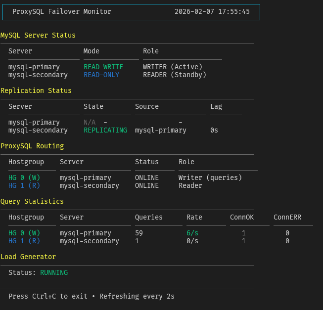

# Reference Guide

This document provides a detailed reference for the commands, scripts, configuration, and troubleshooting steps for the ProxySQL Failover environment.

**What You'll Find Here:**
- [Prerequisites](#prerequisites)
- [Manual Testing & Exploration](#manual-testing--exploration)
- [Scripts Reference](#scripts-reference)
- [Configuration Reference](#configuration-reference)
- [Troubleshooting](#troubleshooting)

## Prerequisites

- Docker and Docker Compose
- A terminal (two terminals recommended for the best experience)

### Software Versions

This environment uses:
- **MySQL**: 8.0
- **ProxySQL**: 3.0.5

To update versions, edit the `image:` lines in [`docker-compose.yml`](docker-compose.yml).

## Manual Testing & Exploration

You can manually control the environment to test specific scenarios.

### 1. Start the Environment
```bash
./scripts/start.sh
```
Starts all containers, configures GTID replication, and verifies health.

### 2. Check Status

**Snapshot:**
```bash
./scripts/status.sh
```
Displays:
- MySQL `read_only` status for both servers.
- Replication status (Seconds_Behind_Master).
- ProxySQL routing table (which server is in which hostgroup).

**Real-time Dashboard:**
For a continuous live view of all components (recommended), open a second terminal and run:
```bash
./scripts/monitor.sh
```



### 3. Trigger Failover
```bash
# Promote 'secondary' to be the new Primary
./scripts/failover.sh secondary

# Check the new state
./scripts/status.sh

# Revert back to original configuration
./scripts/failover.sh primary
```

### 4. Control Load Generator
The load generator simulates traffic (approx. 5 queries/sec).
```bash
# Watch logs
docker logs -f loadgen

# Stop load generation
docker compose stop loadgen

# Resume load generation
docker compose start loadgen
```

### 5. Stop and Cleanup
```bash
./scripts/stop.sh
```
Stops containers and removes volumes (resets data).

## Scripts Reference

All scripts are located in the `scripts/` directory.

| Script | Purpose |
|--------|---------|
| `start.sh` | Start environment with replication initialized. |
| `stop.sh` | Stop environment and cleanup data volumes. |
| `status.sh` | Show MySQL read_only state, replication status, and ProxySQL rules. |
| `failover.sh <target>` | Perform manual failover. Target: `primary` or `secondary`. |
| `monitor.sh [interval]` | Run a real-time monitor dashboard. Default interval: 2s. |
| `test-failover-cycle.sh [interval]` | Run an automated loop of failover/failback. Default: 30s. |
| `reload-proxysql.sh` | Reload ProxySQL configuration from `proxysql.cnf` without restart. |

## Configuration Reference

### Ports & Credentials

| Service | Port | Internal | User | Password |
|:------- |:---- |:---------|:-----|:---------|
| **ProxySQL (App)** | **6033** | | `app_user` | `app_password` |
| **ProxySQL (Admin)** | 6032 | | `admin` | `admin` |
| Primary MySQL | 3307 | 3306 | `root` | `root` |
| Secondary MySQL | 3308 | 3306 | `root` | `root` |

**Database Name:** `company`

### Connection Examples

**Application Connection (Write/Read):**
```bash
mysql -h 127.0.0.1 -P 6033 -u app_user -papp_password
```

**Admin Interface:**
```bash
mysql -h 127.0.0.1 -P 6032 -u admin -padmin
```

### Useful ProxySQL Admin Queries

```sql
-- Check runtime servers and their hostgroups
-- status values: ONLINE, SHUNNED, OFFLINE_SOFT, OFFLINE_HARD
SELECT hostgroup_id, hostname, status FROM runtime_mysql_servers;

-- Check query statistics (Queries = total queries routed to that server)
SELECT hostgroup, srv_host, Queries FROM stats_mysql_connection_pool;

-- Check monitor logs for read_only changes
SELECT * FROM monitor_read_only_log ORDER BY time_start_us DESC LIMIT 5;
```

**Server Status Values:**
| Status | Meaning |
|--------|---------|
| `ONLINE` | Server is healthy and receiving traffic. |
| `SHUNNED` | Server is temporarily excluded due to connection failures. |
| `OFFLINE_SOFT` | Server is draining connections (graceful removal). |
| `OFFLINE_HARD` | Server is immediately removed from rotation. |

## Troubleshooting

### Replication Not Working
Check the replica status on the secondary (or current replica):
```bash
docker exec mysql-secondary mysql -uroot -proot -e "SHOW REPLICA STATUS\G"
```
Look for `Last_IO_Error` or `Last_SQL_Error`.

### ProxySQL Not Routing Correctly
Verify the server status in ProxySQL:
```bash
mysql -h127.0.0.1 -P6032 -uadmin -padmin -e "SELECT * FROM runtime_mysql_servers;"
```
*   **Writer (Active Primary)** should be in **Hostgroup 0** with status `ONLINE`.
*   **Reader (Replica)** should be in **Hostgroup 1** with status `ONLINE`.

### Reset Environment
If the state gets inconsistent, it's often easiest to restart fresh:
```bash
./scripts/stop.sh
./scripts/start.sh
```

### Common Mistakes

| Mistake | Consequence | Solution |
|---------|-------------|----------|
| Promoting before GTID sync completes | Data loss or replication errors | Always wait for `Executed_Gtid_Set` to match before promotion. |
| Not setting `read_only` correctly | ProxySQL routes to wrong server | After failover, verify `read_only` with `./scripts/status.sh`. |
| Forgetting to update replication source | Old Primary still replicating from itself | Use `failover.sh` which handles this automatically. |
| Connecting directly to MySQL instead of ProxySQL | Bypasses routing and failover protection | Always connect via port `6033` for application traffic. |
