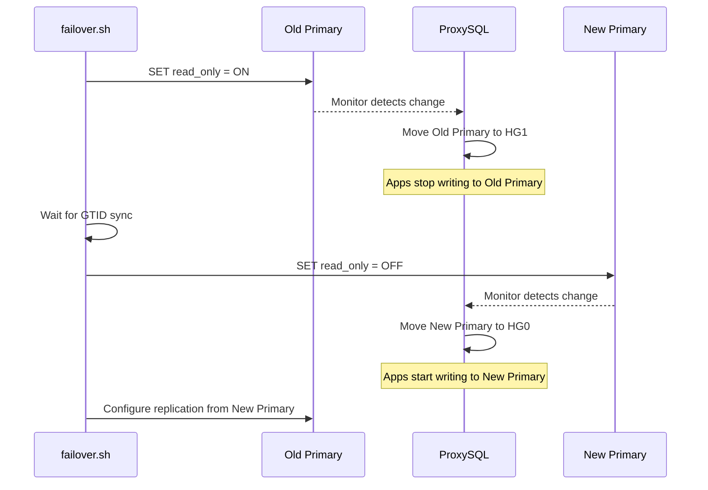

# ProxySQL Failover Tutorial

This tutorial explains how ProxySQL handles failover in this demonstration environment, detailing the configuration, behavior, and monitoring mechanisms.

**By the end of this tutorial, you will understand:**
- How ProxySQL uses `read_only` to detect primary/replica roles
- The sequence of events during a failover
- Why the "Heartbeat Probe" is critical for recovering failed servers
- Key configuration variables that control failover behavior

## Core Concept: Read-Write vs. Read-Only

In a standard High Availability (HA) MySQL setup, you typically have:
*   **Primary (Writer)**: Handles normal application operations.
*   **Secondary (Reader/Replica)**: Used for failover, and potentially for offloading queries (such as reporting).

ProxySQL sits between your application and these databases, acting as a traffic director.

A robust production configuration typically follows this pattern:
1.  **Default to Primary (Writer):** The application sends all standard traffic (Reads & Writes) to the Writer Hostgroup. This ensures strong consistency (you always read your own writes).
2.  **Selective Offloading:** You configure specific Query Rules in ProxySQL to intercept long-running, resource-intensive queries (e.g., analytics reports, batch jobs) and route *only those* to the Secondary (Reader Hostgroup).

This strategy protects the Primary's performance without complicating the application logic with read-after-write consistency issues.

## How ProxySQL Detects Failover

For standard MySQL Async/Semi-Sync Replication topologies, ProxySQL primarily uses the MySQL `read_only` variable to determine a server's role.

While ProxySQL *can* route based on other metrics (replication lag, custom scripts, Galera status), checking `read_only` is the industry standard for this architecture because it is the definitive source of truth for a server's writeability.

### Hostgroups
ProxySQL groups servers logically:
*   **Hostgroup 0 (Writer)**: Servers where `read_only = OFF`.
*   **Hostgroup 1 (Reader)**: Servers where `read_only = ON`.

This automatic assignment is enabled by the `mysql_replication_hostgroups` configuration block:

```
mysql_replication_hostgroups =
(
    {
        writer_hostgroup = 0
        reader_hostgroup = 1
        check_type = "read_only"
    }
)
```

This tells ProxySQL: "For any server you monitor, if `read_only` is OFF, put it in hostgroup 0; otherwise, put it in hostgroup 1."

### The Monitor
ProxySQL has a built-in monitor that checks each server every 1.5 seconds (`monitor_read_only_interval` in `proxysql.cnf`).

1.  It queries `SELECT @@global.read_only`.
2.  If `read_only` is **OFF**, the server is moved to **Hostgroup 0**.
3.  If `read_only` is **ON**, the server is moved to **Hostgroup 1**.

This means you don't need to reconfigure ProxySQL when you promote a new primary; you just change the MySQL configuration, and ProxySQL adapts automatically.

## The Failover Process

It is important to note that **ProxySQL does not manage the failover itself**; it only *reacts* to it. An external tool (like Orchestrator, MHA, or in our case, the `failover.sh` script) must perform the actual promotion.

When a failover occurs (simulated by `./scripts/failover.sh secondary`), the following sequence happens:

1.  **Demotion**: The old Primary is set to `read_only = ON`.
    *   *ProxySQL Action*: Moves it to Hostgroup 1 (Reader). Applications stop writing to it immediately.
2.  **Wait**: The script waits for the Secondary to catch up (GTID sync).
3.  **Promotion**: The Secondary is set to `read_only = OFF`.
    *   *ProxySQL Action*: Moves it to Hostgroup 0 (Writer). Applications start writing to the new Primary.
4.  **Replication Update**: The old Primary is configured to replicate from the new Primary.



## Advanced: The "Heartbeat" Probe and SHUNNED Servers

A critical but often overlooked aspect of ProxySQL is how it handles "SHUNNED" servers.

If a server fails (network blip, crash, or manual stop), ProxySQL marks it as **SHUNNED**. It stops sending *any* application traffic to it to prevent errors.

**The Problem**: If no traffic is sent to the server, how does ProxySQL know when it's back online? The monitor checks `read_only`, but if the server was shunning due to connection errors, it might need a "nudge" to verify it's accepting queries again.

**The Solution: A Heartbeat Probe**

We demonstrate a robust pattern to ensure SHUNNED servers are detected and recovered quickly (Lazy Promotion).

1.  **The Probe Query**: The load generator sends this specific query every 10 seconds:
    ```sql
    SELECT /* ProxySQL read-only */ 'probe' as status
    ```

2.  **The Query Rule**: In `proxysql.cnf`, we have a rule that forces this query to go to the **Reader Hostgroup (1)**, even if the application points to the writer.
    ```
    {
        rule_id = 1
        active = 1
        match_pattern = "/\\* ProxySQL read-only \\*/"
        destination_hostgroup = 1
        apply = 1
    }
    ```

3.  **The Effect**: This forces ProxySQL to attempt a connection to the Reader hostgroup.
    *   If the server is still down, the probe fails (harmless).
    *   If the server is back online, this successful connection signals to ProxySQL that the server is healthy. ProxySQL immediately switches the server status from **SHUNNED** to **ONLINE**, without waiting for the slower default monitor cycles.

Without this probe, a server might remain SHUNNED for much longer, reducing your cluster's capacity.

### Try It: See SHUNNED Recovery in Action

1.  **Start the monitor** in one terminal:
    ```bash
    ./scripts/monitor.sh
    ```
2.  **Stop the secondary** in another terminal:
    ```bash
    docker stop mysql-secondary
    ```
3.  **Observe**: In the monitor, `mysql-secondary` status changes to **SHUNNED**.
4.  **Restart the secondary**:
    ```bash
    docker start mysql-secondary
    ```
5.  **Observe**: Within ~10 seconds (when the next probe query runs), the status changes back to **ONLINE**.

## Configuration Highlights

Key settings used in [`proxysql/proxysql.cnf`](proxysql/proxysql.cnf). See the [official ProxySQL documentation](https://proxysql.com/documentation/global-variables/) for all available variables.

| Variable | Value | Purpose |
|----------|-------|--------|
| `monitor_writer_is_also_reader` | `false` | Keeps the Writer out of the Reader hostgroup for strict separation. |
| `monitor_read_only_interval` | `1500` (1.5s) | How often ProxySQL checks `read_only` for role changes. |
| `monitor_read_only_timeout` | `500` (0.5s) | Fail fast if the server is unresponsive during the check. |
| `shun_on_failures` | `10` | Number of consecutive failures before a server is SHUNNED. |
| `shun_recovery_time_sec` | `3` | Minimum seconds a server stays SHUNNED before automatic recovery. |

---

## Glossary

| Term | Definition |
|------|------------|
| **Hostgroup** | A logical group of MySQL servers in ProxySQL. Queries are routed to a specific hostgroup. |
| **SHUNNED** | A server status indicating ProxySQL has stopped routing traffic to it due to connection failures. |
| **GTID** | Global Transaction Identifier. Ensures replication consistency by uniquely identifying transactions. |
| **`read_only`** | A MySQL variable. When `ON`, the server rejects write queries, marking it as a replica. |
| **Primary / Replica** | Primary (Writer) handles writes; Replica (Reader) replicates data from the Primary. |
